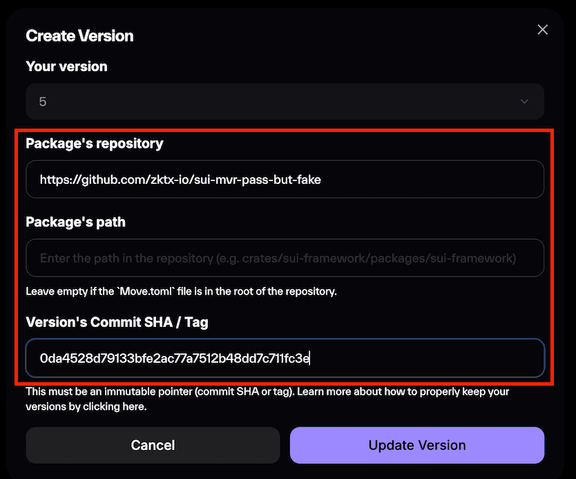

# 🧾 Report: MVR Pass Without Source

## 1. Purpose of This Repository

This repository (`sui-mvr-pass-but-fake`) is a **demonstration of a validation weakness** in the **Move Verifiable Registry (MVR)**.  
It is intentionally crafted to contain **no source code**, yet still **successfully passes** the current **validation logic** in the MVR version creation process.

The purpose of this repository is to highlight that:

- **Validation currently checks configuration, not source authenticity**
- Users can register **unverifiable or misleading entries** with little resistance
- **Trust in the registry system is dependent on user honesty**, not cryptographic enforcement

## 2. Context: The Limitations of Current Validation

The MVR validator performs the following checks:

- Verifies that the GitHub repository is **public**
- Downloads the `Move.lock` file from the specified commit
- Confirms matching `published-version` and `original-published-id`

However, it **does not validate**:

- Whether the commit actually **built the registered on-chain package**
- Whether the repository contains any **source code**
- Whether the `Move.lock` file reflects a **real build**

The modal interface used during version creation includes the following disclaimer:

> **"This does not verify the source, it only verifies the configuration, and can end up with many false positives."**

📸 **Screenshot: Validation warning modal**  

Despite this, users can trivially satisfy the validator by submitting a **fabricated `Move.lock` file** pointing to existing framework packages — even when **no corresponding source or module code** exists in the repo.

## 3. Successful Validation Despite No Code

This repository includes only:

- A `Move.lock` file with **hardcoded dependency metadata**
- **No** `sources/` directory
- **No** modules or transaction scripts

Nonetheless, the version submission **successfully passed** MVR validation.

📸 **Screenshot: Validation passed**  

## 🧩 Conclusion

This test case demonstrates that **the current registry is vulnerable to unverified submissions**.  
While **user honesty is assumed**, this assumption does not scale in a **trust-minimized ecosystem**.

To resolve this, validation should move toward **cryptographically verifiable provenance**, such as:

- **GitHub-based CI workflows** that sign `.intoto.jsonl` provenance files
- **Signature verification** of build output and repository state

This repository exists as a **practical case** for evaluating and improving that direction.